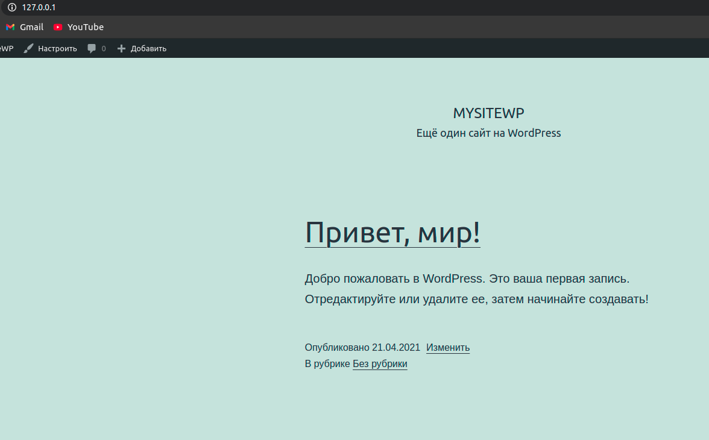
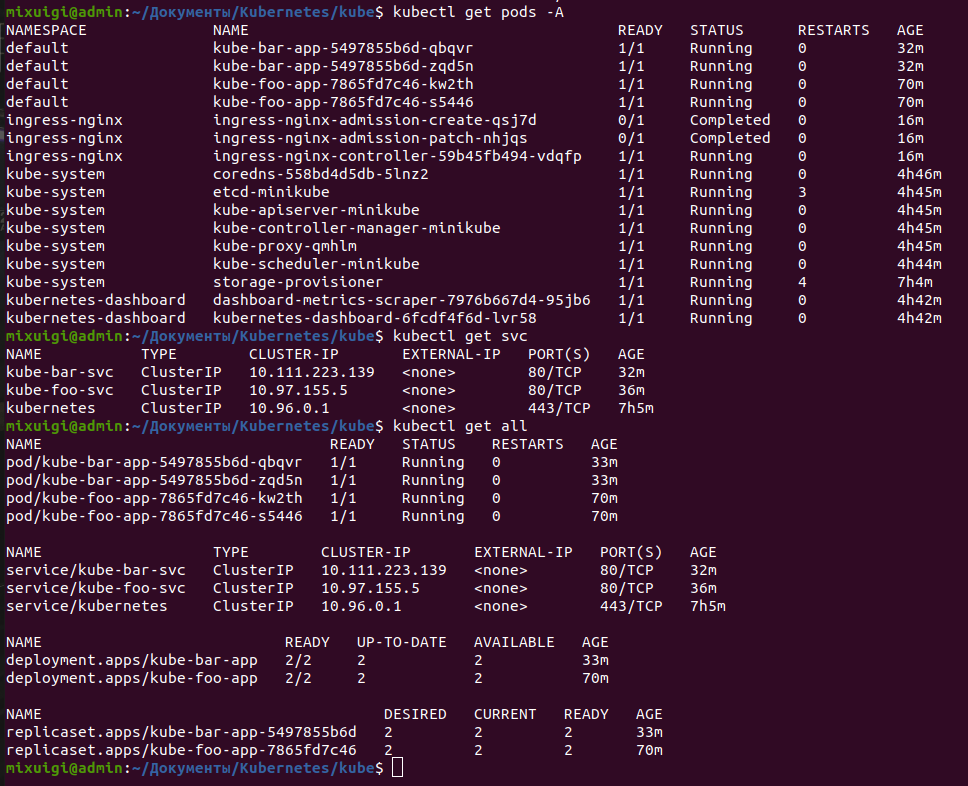

# 1. Docker 

##  1.6.2 Скачал и установил Docker 
  -   
## 1.6.3 Запущенный Nginx  
   -  
   -  
## 1.6.4-5 РAБота с MySql  
   -  
## 1.7 РАБота с Dockerfile  
   - [__My Dockerfile__](Dockerfile)  Запуск image созданного из Dockerfile 
   -   
## 1.8 Docker-compose  
   - [__My Docker-compose file__](wordpress/docker-compose.yml)  Результаты запуска файла  
   -  
## 1.9 Kubernetes  
### Результат работы простейшей программы найденной в интернете
   - [__Kubernetes files__](Kubernetes)  
   -  
### - Пометка  
По неизвестной мне причине после перезагрузки системы при выполнении аналогичных действий для запуска Kubernetes-a. Появляется вот эта ошибка - при выполнении команды __kubectl apply ingress.yaml__   
[ingress file](Kubernetes/kube/ingress.yaml) 
Ошибка: __Error from server (InternalError): error when creating "ingress.yaml": Internal error occurred: failed calling webhook "validate.nginx.ingress.kubernetes.io": an error on the server ("") has prevented the request from succeeding  
   Эта ошибка происходит при попытке запустить ingress file__.  
При том что  __deployments и service__ файлы без проблем запускаются.  
   __UPD__ Проверил, Nginx.ingress.controller Почему-то не устанавливается при выполнении команды __minikube addons enable ingress__. Хотя при установке пишется что он ставится :( 
