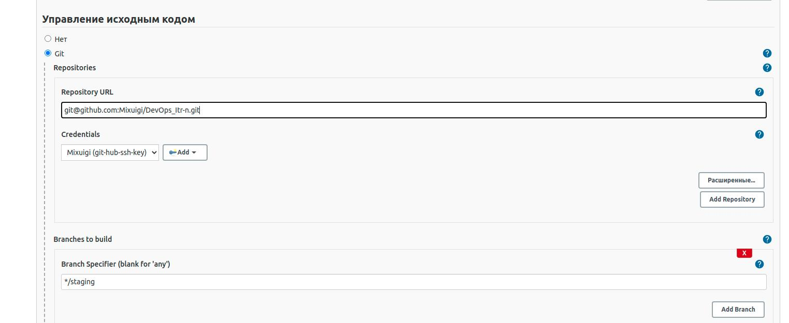
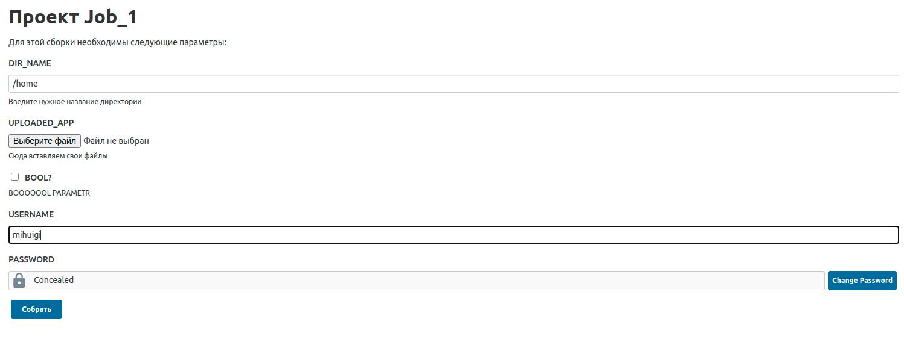
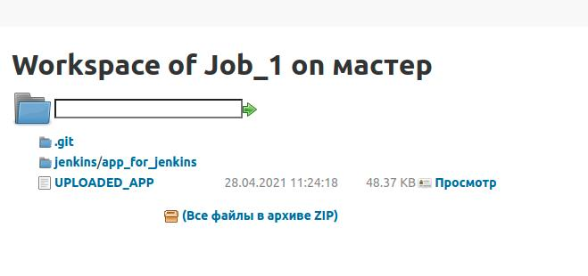
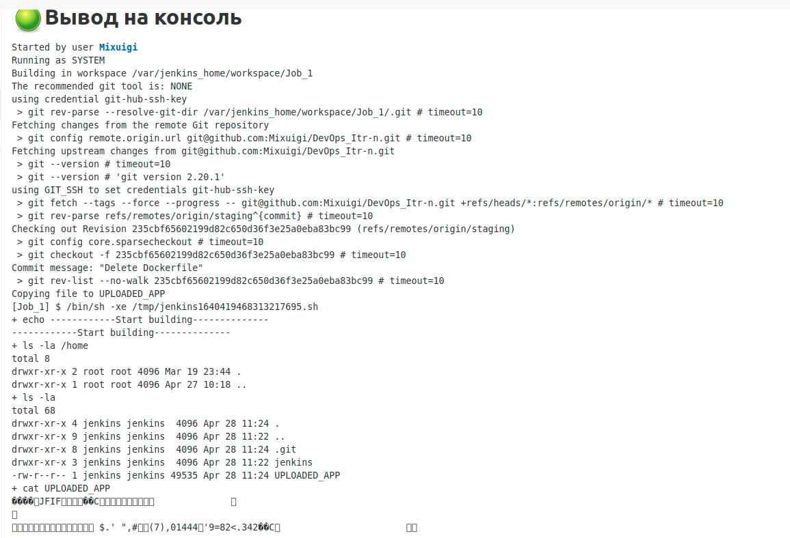

# 1-2 Jenkins  
 - Выбрал подключение к Git по SSH ключу, так безопаснее  
 -  
 - Задал пару параметров
 -  
 - Результат сборки 
 -  + возможность скачивания в Zip 
 - Вывод в консоли  
 -  __(внизу непонятные симвлы из-за добавления в параметры, фотографии)__ 
