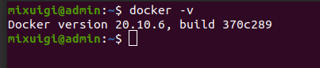
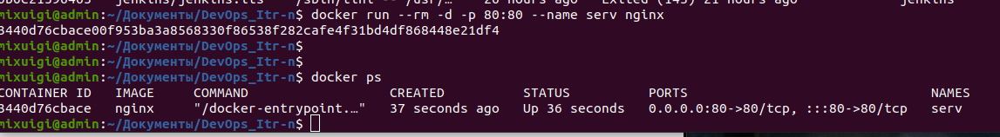
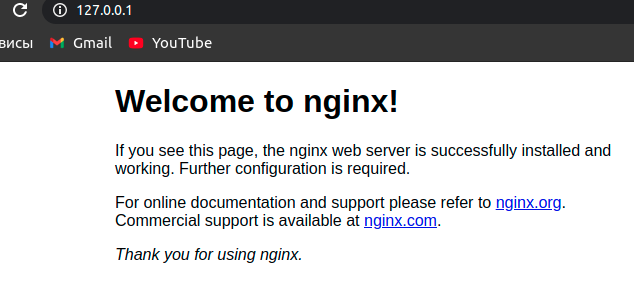
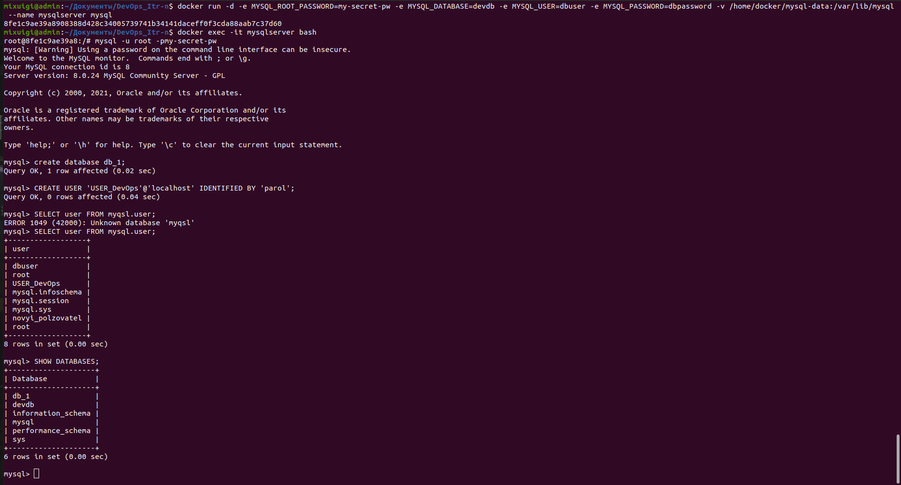
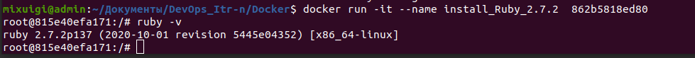

# 1. Docker 

##  1.6.2 Скачал и установил Docker 
  -   
## 1.6.3 Запущенный Nginx  
   -  
   -  
## 1.6.4-5 РAБота с MySql  
   -  
## 1.7 РАБота с Dockerfile  
   - [__My Dockerfile__](https://github.com/Mixuigi/DevOps_Itr-n/blob/master/Docker/Dockerfile)  Запуск image созданного из Dockerfile 
   -   
## 1.8 Docker-compose  
   - 
